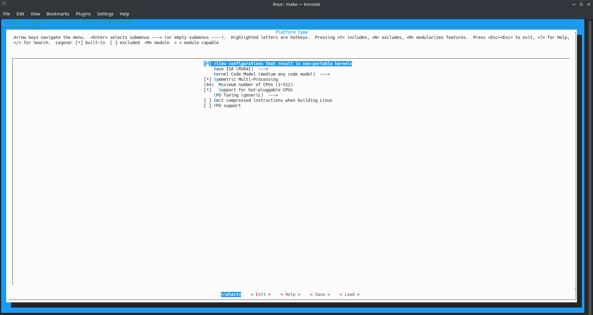
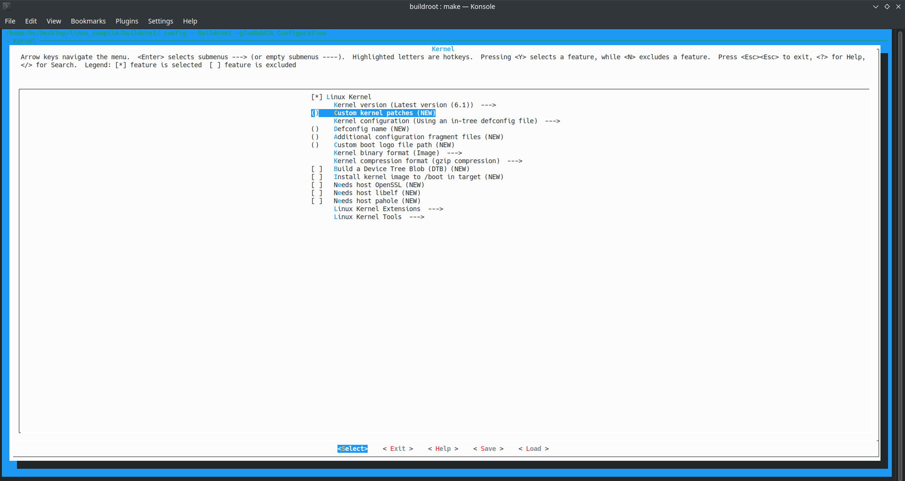

# Multicore Supported Linux Image Creation for RISC‑V Processors

This repository provides a comprehensive, step‑by‑step guide to create a Linux image with multicore (SMP) support for RISC‑V processors. It details the process of setting up the build environment and compiling essential components such as Buildroot, a symmetric multi‑processing (SMP)‑enabled Linux kernel, and the RISC‑V Proxy Kernel (riscv‑pk) featuring the Berkeley Boot Loader (BBL). Whether you’re a developer exploring the RISC‑V architecture or an enthusiast seeking to emulate a many‑core environment, this documentation will help you get started quickly and efficiently.

---

## Overview

The RISC‑V architecture is an open‑source instruction set known for its flexibility and extensibility. This repository simplifies the process of creating a fully functional, emulated environment for many‑core RISC‑V systems by providing ready‑to‑use scripts, configurations, and detailed instructions. By following this guide, you will:

- Generate a minimal root filesystem using Buildroot.
- Compile an SMP‑enabled Linux kernel with native multicore support.
- Build the RISC‑V Proxy Kernel (riscv‑pk) integrated with the Berkeley Boot Loader (BBL).
- Run the resulting image on a custom‑made many‑core RISC‑V processor or within an emulated environment.

Prerequisites: Basic familiarity with Linux command‑line operations and software compilation is assumed.

---

## Getting Started

### 1. Clone the Repository and Update Submodules
Begin by cloning the repository and synchronizing its submodules, which include Buildroot, the Linux kernel, and riscv‑pk:

```
git clone <repository_url>
cd ./Multicore_Linux_Image
./submodule_update
```
Replace <repository_url> with the actual URL of this repository (e.g., `git@github.com:HirunaVishwamith/Multicore_Linux_Image.git`). The `./submodule_update` script downloads and synchronizes all dependent submodules.
### 2. Set Up Environment Variables
Configure your environment by adding the necessary variables to your `~/.bashrc` file:

```
export RISCV=/home/vithurson/buildroot-2022.02.3/output/host
export PATH=$PATH:$RISCV/bin
export ARCH=riscv export CROSS_COMPILE=riscv64-buildroot-linux-uclibc-

generic
```
After updating your `~/.bashrc`, run the configuration script and source the file:

```
./apply_configs_and_patches
source ~/.bashrc
```
This step automatically configures Buildroot, the Linux kernel, and riscv‑pk for RISC‑V emulation. Make sure that the script completes without errors before proceeding.

## Building Components

## Buildroot
Buildroot generates a minimal root filesystem tailored for RISC‑V:

```
cd buildroot
make -j16
```
Run this from the buildroot directory within the repository.
The -j16 flag parallelizes the build across 16 threads. Adjust this number based on your CPU cores (e.g., -j4 for 4 cores) to optimize build time.
The output will be in the output/ directory, including the host tools and root filesystem.

## Linux Kernel
Compile the Linux kernel with RISC-V support:

```
cd linux
make -j16
```

Run Menuconfig:

```
make menuconfig
```
In the menu, navigate to **Platform Type** and enable **Symmetric Multi‑Processing (SMP)**. Save and exit to update the `.config` file.




## Integrate with Buildroot:

Move to the Buildroot directory:

```
cd ../buildroot
```
Open Buildroot’s menuconfig:
```
make menuconfig
```
Go to `Kernel -> Linux Kernel` and select the option to use a custom kernel configuration file. Provide the path to the Linux kernel configuration (e.g., `../linux/.config`). Save your changes. 



Rebuild the Kernel:

```
make -j16
```
This builds a kernel image (arch/riscv/boot/Image) compatible with Multicore RISC-V suport.

## RISC‑V Proxy Kernel (riscv‑pk)

Execute this from the linux directory.

The RISC-V Proxy Kernel (riscv-pk) includes the Berkeley Boot Loader (BBL), which wraps the Linux kernel for execution:

```
cd riscv-pk
mkdir build
cd build
make
```

This will compile riscv‑pk and produce the BBL executable.

## Generating the Multicore‑Supported Device Tree

To create a device tree file tailored for a multicore Linux image, configure the Linux kernel with a default setup optimized for QEMU’s virt machine:


```
cd linux
make qemu_riscv64_virt_defconfig
```

Then integrate this `.cofig` with the buildroot and `make` it again. Then `make` the `build`

To generate the device tree file, run QEMU with the following command:

```
qemu-system-riscv64 -nographic -machine virt -kernel ../riscv-pk/build/bbl -append "root=/dev/vda ro" -drive file=../buildroot/output/images/rootfs.ext2,format=raw,id=hd0 -device virtio-blk-device,drive=hd0
```

This command boots the multicore‑supported Linux image using the compiled BBL, allowing QEMU to generate the necessary device tree.

## Conclusion

By following these instructions, you will have successfully built a multicore‑supported Linux image for RISC‑V processors. This setup enables you to experiment with a fully functional, emulated many‑core RISC‑V environment or deploy the image on custom hardware. For further details or troubleshooting, consult the repository’s additional documentation and support channels.

Happy building!

