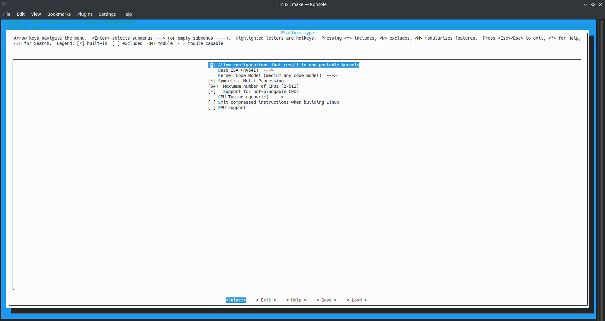
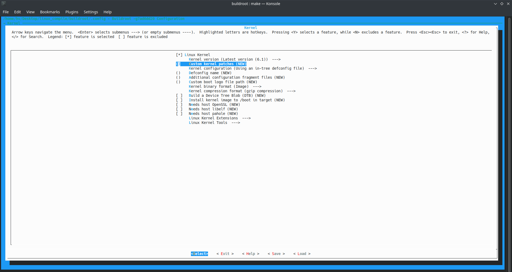

# Multicore Supported Linux Image Creation for RISC‑V Processors

This repository provides a comprehensive, step‑by‑step guide to create a Linux image with multicore (SMP) support for RISC‑V processors. It details the process of setting up the build environment and compiling essential components such as Buildroot, a symmetric multi‑processing (SMP)‑enabled Linux kernel, and the RISC‑V Proxy Kernel (riscv‑pk) featuring the Berkeley Boot Loader (BBL). Whether you’re a developer exploring the RISC‑V architecture or an enthusiast seeking to emulate a many‑core environment, this documentation will help you get started quickly and efficiently.

---

## Overview

The RISC‑V architecture is an open‑source instruction set known for its flexibility and extensibility. This repository simplifies the process of creating a fully functional, emulated environment for many‑core RISC‑V systems by providing ready‑to‑use scripts, configurations, and detailed instructions. By following this guide, you will:

- Generate a minimal root filesystem using Buildroot.
- Compile an SMP‑enabled Linux kernel with native multicore support.
- Build the RISC‑V Proxy Kernel (riscv‑pk) integrated with the Berkeley Boot Loader (BBL).
- Run the resulting image on a custom‑made many‑core RISC‑V processor or within an emulated environment.

Prerequisites: Basic familiarity with Linux command‑line operations and software compilation is assumed.

---

## Getting Started

### 1. Clone the Repository and Update Submodules
Begin by cloning the repository and synchronizing its submodules, which include Buildroot, the Linux kernel, and riscv‑pk:

```
git clone <repository_url>
cd ./Multicore_Linux_Image
./submodule_update
```
Replace <repository_url> with the actual URL of this repository (e.g., `git@github.com:HirunaVishwamith/Multicore_Linux_Image.git`). The `./submodule_update` script downloads and synchronizes all dependent submodules.
### 2. Set Up Environment Variables
Configure your environment by adding the necessary variables to your `~/.bashrc` file:

```
export RISCV=$PWD/buildroot/output/host     # the buildroot host tree (after building buildroot)
export PATH=$PATH:$RISCV/bin
export ARCH=riscv
export CROSS_COMPILE=riscv64-buildroot-linux-uclibc-
```
After updating your `~/.bashrc`, run the configuration script and source the file:

```
./apply_configs_and_patches
source ~/.bashrc
```
This step automatically configures Buildroot, the Linux kernel, and riscv‑pk for RISC‑V emulation. Make sure that the script completes without errors before proceeding.

## Building Components

## Buildroot
Buildroot generates a minimal root filesystem tailored for RISC‑V:

```
cd buildroot
make -j16
```
Run this from the buildroot directory within the repository.
The -j16 flag parallelizes the build across 16 threads. Adjust this number based on your CPU cores (e.g., -j4 for 4 cores) to optimize build time.
The output will be in the output/ directory, including the host tools and root filesystem.

## Linux Kernel
Compile the Linux kernel with RISC-V support:

```
cd linux
make -j16
```

Run Menuconfig:

```
make menuconfig
```
In the menu, navigate to **Platform Type** and enable **Symmetric Multi‑Processing (SMP)**. Save and exit to update the `.config` file.




## Integrate with Buildroot:

Move to the Buildroot directory:

```
cd ../buildroot
```
Open Buildroot’s menuconfig:
```
make menuconfig
```
Go to `Kernel -> Linux Kernel` and select the option to use a custom kernel configuration file. Provide the path to the Linux kernel configuration (e.g., `../linux/.config`). Save your changes. 



Rebuild the Kernel:

```
make -j16
```
This builds a kernel image (arch/riscv/boot/Image) compatible with Multicore RISC-V suport.

## RISC‑V Proxy Kernel (riscv‑pk)

Execute this from the linux directory.

The RISC-V Proxy Kernel (riscv-pk) includes the Berkeley Boot Loader (BBL), which wraps the Linux kernel for execution:

```
cd riscv-pk
mkdir build
cd build
make
```

This will compile riscv‑pk and produce the BBL executable.

## Generating the Multicore‑Supported Device Tree

To create a device tree file tailored for a multicore Linux image, configure the Linux kernel with a default setup optimized for QEMU’s virt machine:


```
cd linux
make qemu_riscv64_virt_defconfig
```

Then integrate this `.cofig` with the buildroot and `make` it again. Then `make` the `build`

To generate the device tree file, run QEMU with the following command:

```
qemu-system-riscv64 -nographic -machine virt -kernel ../riscv-pk/build/bbl -append "root=/dev/vda ro" -drive file=../buildroot/output/images/rootfs.ext2,format=raw,id=hd0 -device virtio-blk-device,drive=hd0
```

This command boots the multicore‑supported Linux image using the compiled BBL, allowing QEMU to generate the necessary device tree.

---

## Building images for the chiron processor (no‑MMU, RAM @ `0x80000000`)

chiron is a **no‑MMU, machine‑mode** RISC‑V core: it has a `satp` CSR but performs **no address translation** (no page‑table walk / TLB in either the golden‑model emulator or the RTL). Therefore only a **nommu, M‑mode** kernel can run on it, and its DRAM lives at **`0x80000000`** (the golden model services a 144 MB window `[0x80000000, 0x89000000)`). The generic steps above target a machine with RAM at `0x10000000`; the steps below produce images that boot on chiron. Both the golden emulator and the RTL load a **flat binary at `0x80000000`** — so the deliverable is `bbl.bin` (bbl + nommu‑kernel payload + embedded dtb), `objcopy`‑ed to a raw binary.

### Quick start (automated)

Once the submodules are cloned and the buildroot toolchain is built, the whole
pipeline is one script:

```
./submodule_update                              # clone linux/ buildroot/ riscv-pk/
cd buildroot && make -j$(nproc) && cd ..        # toolchain + rootfs (slow, once)
export RISCV=$PWD/buildroot/output/host
./apply_configs_and_patches                     # stage chiron configs + patches
./build_image.sh s1                             # -> ../bins/linux-s1.bin  (single-core)
./build_image.sh q4                             # -> ../bins/linux-q4.bin  (quad SMP, best-effort)
```

`build_image.sh` runs exactly the manual steps below (kernel `.config` → `vmlinux`
→ `bbl` → flat `bbl.bin` @ `0x80000000`) and installs the result into the chiron
repo's `bins/`. The rest of this section explains *why* each knob is set.

> **Gotchas that will cost you an afternoon if you skip them**
> - **SMP must be OFF for `linux-s1`.** `linux/.config` and the `riscv-pk/build`
>   tree are shared between the s1 and q4 builds. Building s1 while the tree is
>   still configured `CONFIG_SMP=y` (e.g. right after a q4 build) yields an SMP
>   kernel that **boots to userspace then hangs at `getty`** (CPU-pegged, never
>   prints `buildroot login:`). `build_image.sh s1` forces `--disable SMP`.
> - **The uartlite console options must be set**, or the kernel boots **silently**
>   after bbl's device-tree dump. Use `patches/configs/linux/.config` (has
>   `CONFIG_SERIAL_UARTLITE[_CONSOLE]=y`, `CONFIG_SERIAL_EARLYCON=y`) — **not** the
>   stale `configs/linux/.config`, which is missing them. `apply_configs_and_patches`
>   now stages the correct one.
> - A correct single-core image is **7,541,864 bytes**; an SMP-by-accident image is
>   ~7.88 MB — a quick sanity check.

The kernel/buildroot/riscv‑pk configs in `patches/configs/` already select `CONFIG_RISCV_M_MODE=y` / `# CONFIG_MMU is not set`. `./apply_configs_and_patches` stages them plus the patches below; the rest of this section is what those changes are.

### 1. Relocate the kernel to `0x80000000`

`CONFIG_PAGE_OFFSET` (the nommu RAM/link base) defaults to `0x10200000`. Point it at chiron's RAM by editing `linux/arch/riscv/Kconfig`:

```
config PAGE_OFFSET
	hex
	default 0x80200000 if 64BIT && !MMU   # was 0x10200000
```

Then `cd linux && make olddefconfig` and confirm `CONFIG_PAGE_OFFSET=0x80200000`.

### 2. Device tree (`device_tree/sample.dts`, single‑core)

- `memory@0x80000000` size must fit the emulator's window — use **128 MB**: `reg = <0x0 0x80000000 0x0 0x08000000>;`
- Console must be the uartlite (an M‑mode kernel has no SBI, so `console=hvc0` is silent). Set:
  ```
  chosen { bootargs = "earlycon=uartlite,0x40600000 console=ttyUL0 root=/dev/ram rw rootfstype=ramfs"; };
  ```
- The full uartlite driver needs `current-speed` **and** an interrupt, so the uart node needs `current-speed = <115200>;` and an `interrupt-parent`/`interrupts` pointing at a PLIC node (`sifive,plic-1.0.0` at `0xc000000`, `interrupts-extended = <&cpu0_intc 11>`). See `device_tree/sample.dts`.

Enable the console drivers in the kernel: `CONFIG_SERIAL_UARTLITE_CONSOLE=y`, `CONFIG_SERIAL_EARLYCON=y`.

### 3. Patch the uartlite driver (TX drain + RX poll)

chiron has **no wired uartlite interrupt** (no PLIC interrupt *delivery* in either
the golden model or the RTL), so the driver's IRQ-driven paths never fire. The
shipped `patches/linux/drivers/tty/serial/uartlite.c` carries both fixes; they're
applied automatically by `apply_configs_and_patches` (full-file copy):

- **TX drain** — `ulite_start_tx()` drains the whole TX ring instead of sending
  one byte and waiting for the TX-empty IRQ (otherwise console output stalls
  after the FIFO fills). Safe on real HW: `ulite_transmit()` returns 0 when the
  FIFO is full or the ring is empty.
- **RX poll** (enables **interactive input**) — a `timer_list` armed in
  `ulite_startup()` polls `ULITE_STATUS` every jiffy and drains RX into the tty
  layer, since the RX-valid IRQ never fires. Guarded by `#define CHIRON_RX_POLL`.

```c
static void ulite_start_tx(struct uart_port *port)            /* TX drain */
{
	while (ulite_transmit(port, uart_in32(ULITE_STATUS, port)))
		;
}

#ifdef CHIRON_RX_POLL                                          /* RX poll */
static void ulite_rx_poll(struct timer_list *t)
{
	struct uartlite_data *pdata = from_timer(pdata, t, rx_poll);
	struct uart_port *port = pdata->port;
	unsigned long flags; int busy = 0;
	spin_lock_irqsave(&port->lock, flags);
	while (ulite_receive(port, uart_in32(ULITE_STATUS, port))) busy = 1;
	spin_unlock_irqrestore(&port->lock, flags);
	if (busy) tty_flip_buffer_push(&port->state->port);
	mod_timer(&pdata->rx_poll, jiffies + 1);
}
#endif
```

This is what makes `make linux-emu` a usable shell — the golden model's UART RX
holding register (`hart.uart_rx_byte`) feeds real stdin bytes, and this timer
pulls them into the tty so `login`, `ls`, `mkdir`, … work. (On the RTL, RX is a
separate matter — the RTL UART has no stdin-fed RX port; see "Running on chiron".)

### 4. Build vmlinux + bbl + flat image

```
cd linux && make -j$(nproc) vmlinux            # entry should be 0x80200000
cd ../riscv-pk && mkdir -p build && cd build
../configure --prefix=$RISCV --host=riscv64-buildroot-linux-uclibc \
  --with-arch=rv64ima --with-abi=lp64 --with-mem-start=0x80000000 \
  --with-payload=../../linux/vmlinux --with-dts=../../device_tree/sample.dts \
  --enable-print-device-tree --disable-vm --enable-boot-machine
make                                           # produces bbl + bbl.bin (flat @ 0x80000000)
```

`bbl.bin` is the bootable single‑core image. Stage it into chiron's `bins/` (e.g. `bins/linux-s1.bin`).

### 5. Quad‑core (SMP) image

```
cd linux && ./scripts/config --enable CONFIG_SMP --set-val CONFIG_NR_CPUS 4
make olddefconfig && make -j$(nproc) vmlinux
```

Use a 4‑CPU device tree (`device_tree/sample_quad.dts`: `cpu@0..cpu@3`, each with its own `cpu-intc`; the CLINT and PLIC `interrupts-extended` list every hart), then rebuild bbl with `--with-dts=../../device_tree/sample_quad.dts`. Stage as `bins/linux-q4.bin`.

### 6. Run on chiron

From the chiron repo root:

```
make linux-emu        LINUX_IMAGE=bins/linux-s1.bin   # INTERACTIVE shell on the golden model (fast)
make linux-emu-check  LINUX_IMAGE=bins/linux-s1.bin   # scripted boot-to-login check (CI, non-interactive)
make linux-sim        LINUX_IMAGE=bins/linux-s1.bin   # boot on the RTL core (live console, very slow)
make linux-lockstep   LINUX_IMAGE=bins/linux-s1.bin   # bounded RTL-vs-emulator lock-step (debug)
```

- **`linux-emu`** runs `emu.out` attached to your terminal: it reaches
  `buildroot login:` in ~60 s, and you can log in as **`root`** (no password) and
  run `ls`, `mkdir`, etc. — interactive input works (UART RX holding register +
  the kernel RX-poll patch above).
- **`linux-sim`** boots the *same* flat image on the Verilated RTL core with the
  live UART console. It is slow (~thousands of cycles/s; tens of minutes to the
  kernel banner) — set `LINUX_SIM_HB=1` to print a progress heartbeat. Console
  output requires the RTL UART TX register at `0x40600004` (the chiron RTL was
  fixed to match the kernel's `ULITE_TX`); input on the RTL is **not** stdin-fed
  (the RTL UART has a hardcoded `root\nls..`/`poweroff` auto-login demo instead).

### Known limitations / status

- **Interactive input works on the golden model** (`linux-emu`) — was previously
  unwired; now fixed via the emulator UART RX holding register and the kernel
  uartlite RX-poll patch.
- **Quad‑core SMP** boots to userspace but only **CPU 0 comes online**. Root cause
  is the CLINT software-interrupt (MSIP/IPI) path: the golden model has *no* MSIP
  handling and a single shared, wall-clock `mtime`; the RTL CLINT has per-hart
  `mtimecmp`/`MTIP` and a cycle-driven `mtime`, but its **msip addresses for cores
  1–3 are wrong** (`0x2004004/8/C` instead of `0x2000004/8/C`, colliding with
  mtimecmp). So secondaries can't be released. On the RTL, quad-core is also
  blocked by the known CCU/L2 multi-core deadlock (a spurious front-end redirect
  to `0x80000000`, *not* a timer/CLINT issue — see chiron `DEADLOCK_DIAGNOSIS.md`).

## Conclusion

By following these instructions, you will have successfully built a multicore‑supported Linux image for RISC‑V processors. This setup enables you to experiment with a fully functional, emulated many‑core RISC‑V environment or deploy the image on custom hardware. For further details or troubleshooting, consult the repository’s additional documentation and support channels.

Happy building!

